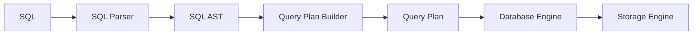

# Toy Database Engine

A toy in-memory relational database engine for educational purposes in order to better understand what are the basic primitives needed to implement a database engine.

SQL is not supported, but implemented lower level API can be used to implement some basic SQL support. 

## Running

You need to have Python 3.10 installed in order to run it. The main and only executable file is `main.py`. There's nothing fancy, it's just runs a predefined query against two tables which should be equvalent to the following SQL:

```sql
select "left".id employee_id
     , "right".id task_id
     , "left".name name
  from employees "left" 
  left outer join tasks "right"
    on "left".id = "right".employee_id
 where "right".employee_id is null
 order by "left".id asc
```

## Database Components



Current database consist of the following components:

* **database engine** - implements primitives to query tables, filter and join with other tables
* **storage engine** - there's no separate component, right now database engine plays the role of storage engine as well
* **query plan builder** - component that is used to build a **query plan**
* **query plan executor** - uses **database engine** to execute a **query plan**
* _**sql parser**_ - parses SQL and produces AST (_not implemented_) which should then be converted to a **query plan**
* _**query plan optimizer**_ - analyze and optimize **query plan** (_not implemented_). Don't really know if it should be applied to SQL AST or the **query plan**.
